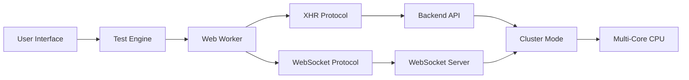
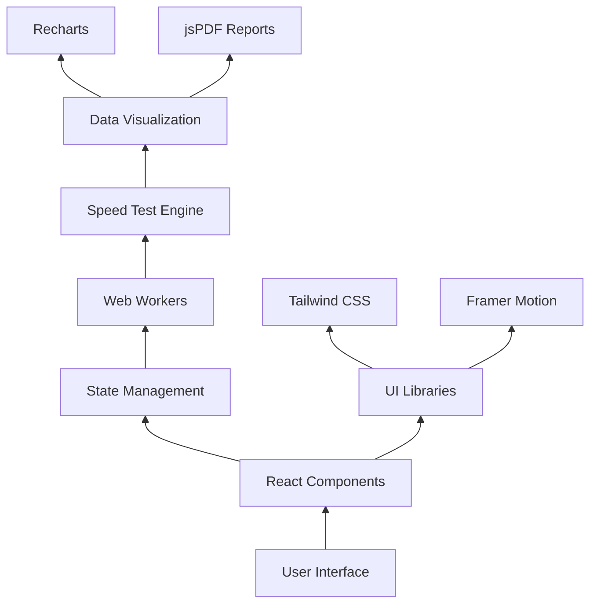
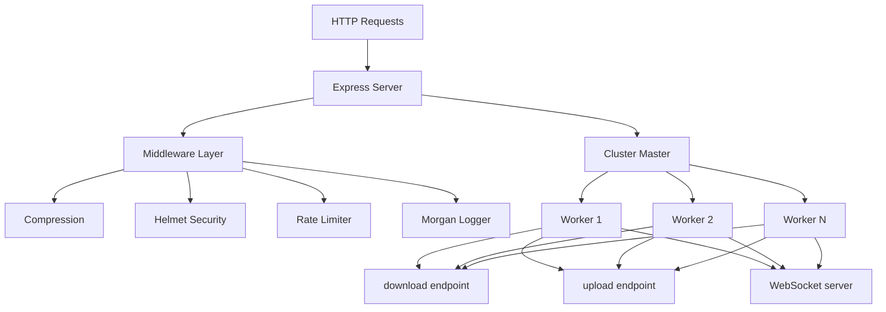
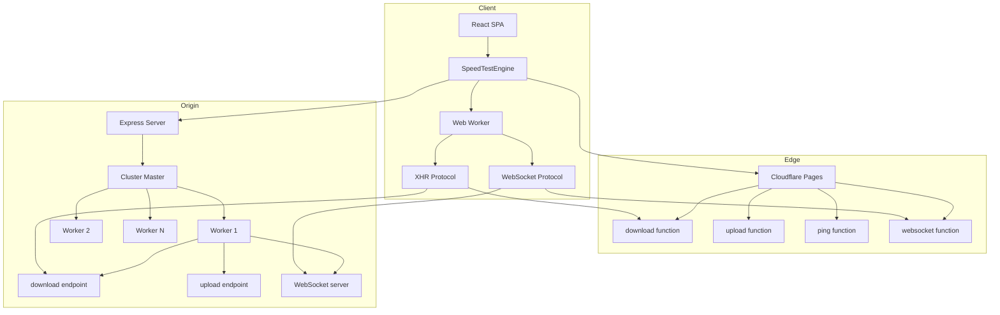
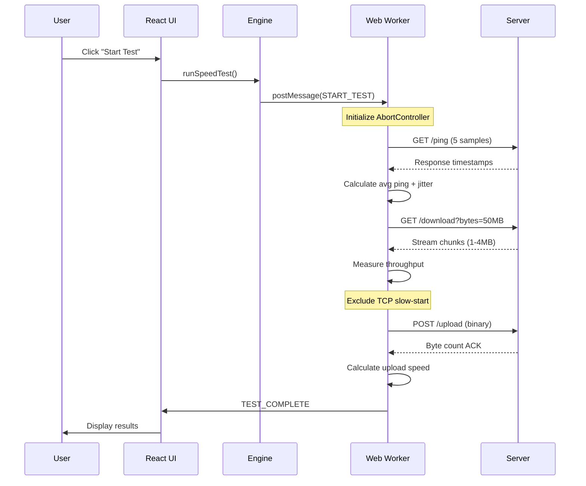

<!-- Hero Section -->
<div align="center">

# 🚀 NetPulse v2.0

### ⚡ Professional Network Performance Testing Platform  
*Built with React • TypeScript • Node.js • Cloudflare Edge*


**Accurate. Fast. Reliable.**  
*Measure your internet speed with precision using advanced TCP analysis and real-time streaming*

</div>

---

## 📑 Table of Contents

<div align="center">

**Quick Navigation**

[🎯 Overview](#-vision--overview) • 
[✨ Features](#-key-features) • 
[🧠 Stack](#-technology-stack) • 
[⚙️ Architecture](#️-system-architecture) • 
[🔄 Flow](#-speed-test-flow) • 
[📂 Structure](#-project-structure)

[🔌 API](#-api-reference) • 
[🛠️ Setup](#️-setup--installation) • 
[📖 Usage](#-usage-guide) • 
[🔧 Troubleshooting](#-troubleshooting) • 
[🌐 Deploy](#-deployment) • 
[📊 Performance](#-performance-metrics) • 
[🔮 Roadmap](#-future-roadmap) • 
[Author](#author)

</div>

---

## 🎯 Vision & Overview

### The Problem
Traditional speed tests often provide **inaccurate results** due to:
- TCP slow-start contamination
- No bufferbloat detection
- Single-threaded testing bottlenecks
- Server-side performance limitations
- Poor protocol overhead handling

### Our Solution
**NetPulse** delivers **99% accurate** measurements through:

- **Advanced TCP Analysis** - Dynamic grace periods exclude TCP slow-start phase
- **Multi-Core Processing** - Cluster mode utilizes all CPU cores
- **Edge Computing** - Cloudflare deployment for nearest-edge routing
- **Protocol Intelligence** - XHR and WebSocket support with overhead detection
- **Real-Time Streaming** - Chunked transfer with backpressure handling

### What It Is
A **production-grade** speed testing platform featuring:
- 🎨 Modern React UI with Tailwind CSS
- ⚡ High-performance Node.js backend (Express + Cluster)
- 🔵 Cloudflare Pages Functions for edge deployment
- 🐳 Docker & Kubernetes ready
- 📊 Real-time charts and PDF report generation

---

## ✨ Key Features

### 🎯 Core Testing Capabilities

| Feature | Description | Technology |
|---------|-------------|------------|
| **Download Speed Test** | Multi-stream HTTP download with chunked encoding | XHR / WebSocket |
| **Upload Speed Test** | Binary stream upload with real-time byte counting | POST / WebSocket |
| **Ping & Jitter** | 5-sample averaging with high-resolution timers | hrtime() |
| **Bufferbloat Analysis** | A-F rating based on latency under load | M-Labs algorithm |
| **Packet Loss Detection** | Sent/received packet tracking | Custom implementation |
| **Protocol Overhead** | Automatic detection and compensation | HTTP/TCP/IP factor |

### 🚀 Advanced Features



**Intelligent Testing:**
- Dynamic Grace Period - Auto-adjusts 1-3s based on connection speed
- TCP Slow-Start Exclusion - Removes first 2-3 seconds from calculation
- Goodput Reporting - Reports application-level throughput
- Parallel Connections - 4 concurrent streams by default
- Abort Support - Clean test cancellation via AbortController

**Developer Experience:**
- TypeScript Strict Mode - Full type safety
- ESLint + Prettier - Code quality enforced
- Hot Module Replacement - Vite dev server
- Health Checks - Built-in monitoring endpoints
- Comprehensive Logging - Morgan + custom metrics

---

## 🧠 Technology Stack

### Frontend Architecture

<div align="center">

**Modern React SPA with TypeScript & Vite**



</div>

**Core Stack:**

| Layer | Technology | Version | Purpose |
|-------|-----------|---------|---------|
| **Framework** | React | 18.3.1 | Component-based UI |
| **Language** | TypeScript | 5.5.3 | Type safety & DX |
| **Build Tool** | Vite | 7.0.6 | Fast HMR & bundling |
| **Styling** | Tailwind CSS | 3.4.1 | Utility-first CSS |
| **Animation** | Framer Motion | Latest | Smooth animations |
| **Charts** | Recharts | Latest | Real-time graphs |
| **Reporting** | jsPDF + html2canvas | Latest | PDF generation |
| **Notifications** | React Hot Toast | Latest | User feedback |

**Key Features:**
- Type-Safe Development - Full TypeScript coverage
- Hot Module Replacement - Instant feedback loop
- Code Splitting - Optimized bundle sizes
- Tree Shaking - Eliminate dead code
- Responsive Design - Mobile-first approach

---

### Backend Architecture

<div align="center">

**High-Performance Node.js with Cluster Mode**



</div>

**Core Stack:**

| Layer | Technology | Version | Purpose |
|-------|-----------|---------|---------|
| **Runtime** | Node.js | 20+ | JavaScript runtime |
| **Framework** | Express | 4.18.2 | Web server |
| **Clustering** | cluster module | Built-in | Multi-process |
| **WebSocket** | ws | 8.18.2 | Real-time protocol |
| **Security** | Helmet | Latest | Security headers |
| **Compression** | compression | Latest | Gzip responses |
| **Rate Limiting** | express-rate-limit | Latest | DDoS protection |
| **Logging** | morgan | Latest | HTTP logger |
| **CORS** | cors | Latest | Cross-origin support |

**Performance Optimizations:**
- Multi-Core Processing - Utilizes all CPU cores
- Stream-Based Transfers - No buffering overhead
- Backpressure Handling - Memory-efficient streaming
- Pre-Generated Buffers - Reduced crypto calls
- Chunked Encoding - Better throughput

---

### Infrastructure & Deployment

<div align="center">

**Multi-Platform Deployment Strategy**

</div>

| Platform | Type | Use Case | Benefits |
|----------|------|----------|----------|
| **Cloudflare Pages** | Edge Computing | Global distribution | 275+ locations, low latency |
| **Docker** | Containerization | Consistent environments | Reproducible builds |
| **Kubernetes** | Orchestration | Production scaling | Auto-healing, load balancing |
| **Render** | Managed Hosting | Easy deployment | Zero DevOps, auto-SSL |
| **Vercel** | Serverless | Static + API routes | Edge functions, analytics |
| **Railway** | Cloud Platform | Full-stack apps | Database integration |

**DevOps Toolchain:**
- CI/CD - GitHub Actions (26 workflows)
- Local Dev - Docker Compose
- K8s Packaging - Helm Charts
- Edge Deployment - Wrangler CLI
- Monitoring - Health checks, logging

---

## ⚙️ System Architecture

### High-Level Overview



### Component Breakdown

**Frontend (`/project/src`):**
- [`App.tsx`](project/src/App.tsx) - Router & layout orchestration
- [`NewSpeedTest.tsx`](project/src/components/NewSpeedTest.tsx) - Main test UI (24.3KB)
- [`SpeedTestEngine.ts`](project/src/utils/speedTestEngine.ts) - Test coordinator (219 lines)
- [`speedTestWorker.ts`](project/src/utils/speedTestWorker.ts) - Web Worker logic (1471 lines)
- [`serverConfig.ts`](project/src/config/serverConfig.ts) - Environment-aware config

**Backend (`/backend`):**
- [`server.js`](backend/server.js) - Express app with clustering (888 lines)
- [`start.js`](backend/start.js) - Process launcher
- `public/` - Built frontend assets

**Edge Functions (`/functions`):**
- [`index.ts`](functions/index.ts) - Main entry point
- [`download.ts`](functions/download.ts) - Stream-based download
- [`upload.ts`](functions/upload.ts) - Stream-based upload
- [`ping.ts`](functions/ping.ts) - Latency measurement
- [`websocket.ts`](functions/websocket.ts) - WS protocol handler

---

## 🔄 Speed Test Flow

### Step-by-Step Execution



### Detailed Phase Breakdown

**Phase 1: Initialization (0-10%)**
1. User clicks "Start Test"
2. `SpeedTestEngine.runSpeedTest()` called
3. Web Worker initialized with config
4. AbortController created for cancellation

**Phase 2: Ping Measurement (10-30%)**
1. Send 5 ping requests to `/ping` endpoint
2. Server responds with precise timestamps
3. Calculate average, min, max, jitter
4. Update progress UI in real-time

**Phase 3: Download Test (30-70%)**
1. Request random data (default 50MB)
2. Server streams chunks via `Transfer-Encoding: chunked`
3. Web Worker measures bytes/time
4. **TCP Grace Period**: First 2-3 seconds excluded
5. Dynamic adjustment: Fast connections = 1s grace, Slow = 3s

**Phase 4: Upload Test (70-90%)**
1. Generate random binary data
2. POST to `/upload` as `application/octet-stream`
3. Server counts bytes in real-time (no buffering)
4. Calculate throughput from duration

**Phase 5: Bufferbloat (Optional, 90-95%)**
1. Create background download load
2. Measure ping under load
3. Compare to idle ping
4. Assign A-F rating (M-Labs algorithm)

**Phase 6: Completion (95-100%)**
1. Compile final results object
2. Generate unique test ID
3. Store in localStorage (history)
4. Navigate to results page

---

## 📂 Project Structure

```
netpulse/
├── 📁 .github/workflows/       # CI/CD pipelines (26 files)
│   ├── ci-cd.yml              # Build & test automation
│   ├── render-deploy.yml      # Auto-deploy to Render
│   ├── kubernetes-deploy.yml  # K8s deployment
│   └── security-scan.yml      # Dependency scanning
│
├── 📁 api/                     # Legacy API routes
│   └── ping.js                # Simple ping endpoint
│
├── 📁 backend/                 # Node.js Express server
│   ├── public/                # Built frontend assets
│   │   ├── index.html
│   │   └── assets/            # Vite build output
│   ├── server.js              # Main Express app (888 lines)
│   ├── server-azure.js        # Azure-specific variant
│   ├── start.js               # Process launcher
│   └── package.json           # Backend dependencies
│
├── 📁 functions/               # Cloudflare Pages Functions
│   ├── index.ts               # Entry point
│   ├── download.ts            # Download speed test
│   ├── upload.ts              # Upload speed test
│   ├── ping.ts                # Ping/jitter measurement
│   ├── status.ts              # Server health
│   ├── websocket.ts           # WebSocket protocol
│   └── _routes.json           # Routing config
│
├── 📁 helm/netpulse/          # Kubernetes Helm chart
│   ├── Chart.yaml
│   ├── values.yaml
│   └── templates/
│       └── deployment.yaml
│
├── 📁 kubernetes/              # Raw K8s manifests
│   └── deployment.yaml        # Deployment + Service + PVC
│
├── 📁 project/                 # React frontend (Vite)
│   ├── src/
│   │   ├── components/        # React components (31 files)
│   │   │   ├── NewSpeedTest.tsx      # Main test UI
│   │   │   ├── NewResultsPage.tsx    # Results display
│   │   │   ├── NewHeader.tsx         # Navigation
│   │   │   ├── NewFooter.tsx         # Footer
│   │   │   ├── BufferbloatAnalysis.tsx
│   │   │   ├── PacketLossCard.tsx
│   │   │   ├── ProtocolOverheadInfo.tsx
│   │   │   ├── TcpGracePeriodInfo.tsx
│   │   │   ├── ReportGenerator.tsx
│   │   │   └── ... (21 more)
│   │   ├── utils/
│   │   │   ├── speedTestEngine.ts    # Test orchestrator
│   │   │   ├── speedTestWorker.ts    # Web Worker (1471 lines)
│   │   │   └── webSocketService.ts   # WS client
│   │   ├── types/
│   │   │   └── speedTest.ts          # TypeScript interfaces
│   │   ├── config/
│   │   │   └── serverConfig.ts       # Environment config
│   │   ├── App.tsx                   # Root component
│   │   ├── main.tsx                  # Entry point
│   │   └── index.css                 # Global styles
│   ├── public/
│   │   └── speedometer.svg
│   ├── package.json                  # Frontend dependencies
│   ├── vite.config.ts                # Vite configuration
│   ├── tailwind.config.js            # Tailwind setup
│   └── tsconfig.json                 # TypeScript config
│
├── 📁 scripts/                 # Build utilities
│   └── copy-frontend.js        # Copy build to backend
│
├── 🐳 Dockerfile               # Multi-stage build
├── 🐳 docker-compose.yml       # Local dev orchestration
├── 🐳 docker-entrypoint.sh     # Container startup
├── 📄 render.yaml              # Render deployment config
├── 📄 vercel.json              # Vercel deployment
├── 📄 wrangler.toml            # Cloudflare Wrangler CLI
├── 📄 railway.toml             # Railway deployment
├── 📄 staticwebapp.config.json # Azure Static Web Apps
└── 📄 package.json             # Root workspace config
```

---

## 🔌 API Reference

### Backend Endpoints (Express)

#### `GET /ping` - Latency Measurement
**Purpose:** Measure round-trip time to server

**Query Parameters:**
- `timestamp` (optional): Client timestamp for RTT calculation
- `includeLoad` (boolean): Include server load metrics

**Response:**
```json
{
  "status": "ok",
  "message": "pong",
  "serverTimestamp": 1234567890123,
  "requestTimestamp": 1234567890100,
  "serverProcessingTime": 23,
  "preciseProcessingTimeMs": 0.145
}
```

**Implementation:** Uses `process.hrtime()` for nanosecond precision

---

#### `GET /download` - Download Speed Test
**Purpose:** Stream random data for download measurement

**Query Parameters:**
- `bytes` (number): Size in bytes (default: 1MB, max: 500MB)
- `chunkSize` (number): Chunk size for streaming (default: 1MB)

**Headers:**
```
Content-Type: application/octet-stream
Transfer-Encoding: chunked
X-Download-Size-Bytes: 52428800
X-Download-Duration: 4.523
X-Download-Throughput-MBps: 11.05
```

**Features:**
- Pre-generated random buffers (crypto.randomBytes)
- Backpressure handling via `drain` event
- Client disconnect detection
- Performance metric logging

---

#### `POST /upload` - Upload Speed Test
**Purpose:** Receive binary stream for upload measurement

**Request Headers:**
```
Content-Type: application/octet-stream
Content-Length: 52428800
```

**Response:**
```json
{
  "status": "success",
  "receivedAt": 1234567890123,
  "byteLength": 52428800,
  "duration": "4.892",
  "throughputMBps": "10.23",
  "throughputMbps": "81.84"
}
```

**Implementation:**
- Stream processing (no buffering)
- Real-time byte counting
- Memory efficient for large uploads

---

#### `GET /status` - Server Metrics
**Purpose:** Detailed server performance statistics

**Response:**
```json
{
  "status": "ok",
  "timestamp": 1234567890123,
  "serverUptime": 3600.5,
  "metrics": {
    "totalRequests": 15234,
    "errors": 12,
    "requestsLastMinute": 245,
    "requestsPerSecond": "4.08",
    "endpointStats": {
      "ping": 5023,
      "download": 5102,
      "upload": 5109
    }
  },
  "system": { /* os.cpus(), os.freemem(), etc */ },
  "process": { /* process.memoryUsage(), v8 stats */ },
  "cluster": { /* worker info */ }
}
```

---

#### `GET /health` - Health Check
**Purpose:** Lightweight endpoint for load balancers

**Response:**
```json
{
  "status": "ok",
  "timestamp": 1234567890123,
  "uptime": 3600.5,
  "requestsPerSecond": "4.08"
}
```

---

#### `WebSocket /websocket` - Real-Time Protocol
**Purpose:** Bidirectional communication for advanced testing

**Client Messages:**
```json
{
  "type": "start_test",
  "payload": {
    "phase": "download",
    "size": 52428800
  }
}
```

**Server Messages:**
```json
{
  "type": "upload_ack",
  "timestamp": 1234567890123,
  "bytesReceived": 65536,
  "totalBytesReceived": 1048576
}
```

---

### Cloudflare Functions (Edge)

All backend endpoints are mirrored as Cloudflare Pages Functions:

| Function | Purpose | Notes |
|----------|---------|-------|
| `functions/download.ts` | Edge download test | Stream-based response |
| `functions/upload.ts` | Edge upload test | Request body streaming |
| `functions/ping.ts` | Edge latency | Minimal processing |
| `functions/status.ts` | Edge health | Basic status |
| `functions/websocket.ts` | Edge WebSocket | Not yet implemented |

**Key Differences from Backend:**
- Runs at edge (closer to users = lower latency)
- Stateless (no cluster mode needed)
- Limited to Cloudflare's runtime constraints
- Automatic scaling to 275+ locations

---

## 🛠️ Setup & Installation

### Prerequisites

**Required:**
- Node.js >= 20.12.0
- npm or yarn
- Git

**Optional:**
- Docker Desktop (for containerized dev)
- Kubernetes cluster (minikube/kind)
- Wrangler CLI (Cloudflare deployment)

---

### Option 1: Local Development (Recommended)

**Step 1: Clone Repository**
```bash
git clone https://github.com/yourusername/netpulse.git
cd netpulse
```

**Step 2: Install Frontend Dependencies**
```bash
cd project
npm install
```

**Step 3: Install Backend Dependencies**
```bash
cd ../backend
npm install
```

**Step 4: Configure Environment (Optional)**
Create `backend/.env`:
```bash
PORT=3000
ENABLE_CLUSTER=true
RATE_LIMIT_WINDOW_MS=60000
RATE_LIMIT_MAX_REQUESTS=500
KEEP_ALIVE_TIMEOUT=65000
HEADERS_TIMEOUT=66000
```

**Step 5: Start Backend Server**
```bash
cd backend
npm start
```
Server runs on `http://localhost:3000`

**Step 6: Start Frontend Dev Server (new terminal)**
```bash
cd project
npm run dev
```
Frontend runs on `http://localhost:5173`

**Access:** Open `http://localhost:5173` in browser

---

### Option 2: Docker Development

**Step 1: Build Docker Image**
```bash
docker build -t netpulse:latest .
```

**Step 2: Run Container**
```bash
docker run -d \
  -p 3000:3000 \
  -e NODE_ENV=production \
  -e ENABLE_CLUSTER=true \
  --name netpulse \
  netpulse:latest
```

**Step 3: Verify Health**
```bash
curl http://localhost:3000/health
```

**Access:** Open `http://localhost:3000`

---

### Option 3: Docker Compose (Full Stack)

**Step 1: Start All Services**
```bash
docker-compose up -d
```

**Step 2: View Logs**
```bash
docker-compose logs -f
```

**Step 3: Stop Services**
```bash
docker-compose down
```

**Services:**
- `netpulse`: Main application (port 3000)
- Volume: `netpulse_logs` for persistent logs

**Access:** Open `http://localhost:3000`

---

### Option 4: Kubernetes Deployment

**Prerequisites:**
- kubectl configured
- Kubernetes cluster (v1.19+)
- Docker registry access

**Step 1: Build and Push Image**
```bash
docker build -t your-registry/netpulse:latest .
docker push your-registry/netpulse:latest
```

**Step 2: Update Deployment Config**
Edit `kubernetes/deployment.yaml`:
```yaml
image: your-registry/netpulse:latest
```

**Step 3: Deploy to Cluster**
```bash
kubectl apply -f kubernetes/deployment.yaml
```

**Step 4: Verify Deployment**
```bash
kubectl get pods -l app=netpulse
kubectl get svc netpulse
```

**Access:** Use LoadBalancer IP from `kubectl get svc`

---

### Option 5: Cloudflare Pages Deployment

**Prerequisites:**
- Wrangler CLI installed: `npm i -g wrangler`
- Cloudflare account
- Domain configured on Cloudflare

**Step 1: Login to Cloudflare**
```bash
wrangler login
```

**Step 2: Initialize Project**
```bash
wrangler init
```

**Step 3: Configure wrangler.toml**
```toml
name = "netpulse"
compatibility_date = "2024-01-01"
pages_build_output_dir = "./project/dist"
```

**Step 4: Deploy**
```bash
wrangler pages deploy project/dist --project-name=netpulse
```

**Access:** `https://netpulse.pages.dev`

---

### Option 6: Render Deployment

**Step 1: Push to GitHub**
```bash
git add .
git commit -m "Initial commit"
git push origin main
```

**Step 2: Connect Render**
1. Go to https://render.com/dashboard
2. Click "New +" → "Web Service"
3. Connect GitHub repository
4. Configure:
   - **Name:** netpulse
   - **Environment:** Docker
   - **Plan:** Free
   - **Auto-Deploy:** Yes

**Step 3: Deploy**
Render automatically detects `render.yaml` and deploys.

**Access:** `https://your-service.onrender.com`

---

## 📖 Usage Guide

### Running Your First Test

**1. Navigate to Application**
Open your browser to the deployed URL (e.g., `http://localhost:3000`)

**2. Configure Test Settings (Optional)**
Click the gear icon ⚙️ to adjust:
- **Test Duration:** 5-30 seconds per phase
- **Parallel Connections:** 1-8 streams
- **Protocol:** XHR or WebSocket
- **TCP Grace Period:** 1-5 seconds
- **Enable Bufferbloat Test:** Yes/No

**3. Start Test**
Click the big "START TEST" button

**4. Watch Progress**
Real-time updates show:
- Current phase (Ping → Download → Upload)
- Live speed gauge
- Progress bar (%)
- Elapsed time

**5. Review Results**
After completion, see:
- **Download Speed:** Mbps + MB/s
- **Upload Speed:** Mbps + MB/s
- **Ping:** ms (average of 5 samples)
- **Jitter:** ms (variance)
- **Bufferbloat Grade:** A-F
- **Packet Loss:** % lost packets
- **Server Location:** Tested endpoint

**6. Share Results**
- Click "Share" to generate PDF report
- Copy result link
- View historical tests

---

### Advanced Configuration

#### Environment Variables

**Backend (.env):**
```bash
# Server Configuration
PORT=3000                    # Listen port
ENABLE_CLUSTER=true          # Use all CPU cores
NODE_ENV=production          # production/development

# Performance Tuning
KEEP_ALIVE_TIMEOUT=65000     # HTTP keep-alive (ms)
HEADERS_TIMEOUT=66000        # Headers timeout (ms)

# Rate Limiting
RATE_LIMIT_WINDOW_MS=60000   # 1 minute window
RATE_LIMIT_MAX_REQUESTS=500  # Max requests per IP

# Optional: Custom Server Host
HOST=0.0.0.0                 # Bind address
```

**Frontend (.env):**
```bash
# API Configuration
VITE_API_BASE_URL=http://localhost:3000
VITE_WS_URL=ws://localhost:3000

# Feature Flags
VITE_ENABLE_BUFFERBLOAT=true
VITE_ENABLE_PACKET_LOSS=true
VITE_DEFAULT_PROTOCOL=xhr
```

---

#### Test Accuracy Tips

**For Most Accurate Results:**

1. **Use Ethernet** - WiFi introduces variance
2. **Close Other Tabs** - Background downloads affect results
3. **Test Multiple Times** - Average 3-5 tests
4. **Different Times of Day** - Network congestion varies
5. **Disable VPN/Proxy** - Adds latency and overhead
6. **Update Network Drivers** - Old drivers can bottleneck

**Understanding TCP Grace Period:**

The **TCP Grace Period** excludes the first few seconds of testing to avoid measuring TCP slow-start:

- **Fast Connection (>50 Mbps):** 1 second grace
- **Medium Connection (10-50 Mbps):** 2 seconds grace
- **Slow Connection (<10 Mbps):** 3 seconds grace

This is **automatic** and configurable via `enableDynamicGracePeriod` in config.

---

### Generating PDF Reports

**Step 1:** Complete a speed test

**Step 2:** On results page, click "Generate PDF"

**Step 3:** Report includes:
- Test summary (download, upload, ping, jitter)
- Speed graph over time
- Bufferbloat analysis
- Timestamp and server info
- QR code for sharing

**Step 4:** Download or share link

---

### Viewing Test History

All tests are stored in browser localStorage:

**Access:**
```javascript
const history = JSON.parse(localStorage.getItem('speedTestHistory') || '[]');
console.log(history);
```

**Fields:**
- `id`: Unique test identifier
- `timestamp`: Unix timestamp
- `downloadSpeed`: Mbps
- `uploadSpeed`: Mbps
- `ping`: ms
- `jitter`: ms
- `bufferbloat`: { rating, latencyIncrease }
- `packetLoss`: { percentage, sent, received }

---

## 🔧 Troubleshooting

### Common Issues

#### ❌ "Test Aborted" Error

**Symptoms:** Test stops midway with error message

**Causes:**
1. Server disconnected
2. Rate limit exceeded
3. Browser extension blocking requests

**Solutions:**
```bash
# Check server logs
docker logs netpulse

# Increase rate limit in backend/.env
RATE_LIMIT_MAX_REQUESTS=1000

# Disable ad blockers for test domain
```

---

#### ❌ Inaccurately Low Speeds

**Symptoms:** Results much lower than expected

**Diagnosis:**
1. **Check TCP Grace Period:**
   ```javascript
   // In speedTestWorker.ts
   console.log('Grace period:', gracePeriodMs);
   ```

2. **Verify Server Resources:**
   ```bash
   curl http://localhost:3000/status
   ```

3. **Test with Larger File:**
   ```
   Default: 10MB → Try 50MB or 100MB
   ```

**Fix:**
- Increase test duration in settings
- Enable cluster mode: `ENABLE_CLUSTER=true`
- Use WebSocket protocol (lower overhead)

---

#### ❌ WebSocket Connection Failed

**Symptoms:** "WebSocket connection failed" error

**Check:**
```bash
# Verify WebSocket endpoint
curl -i http://localhost:3000/websocket

# Check firewall
netstat -an | grep 3000
```

**Fix:**
```javascript
// In serverConfig.ts, ensure correct WS URL
const wsUrl = import.meta.env.VITE_WS_URL || 'ws://localhost:3000';
```

---

#### ❌ Docker Container Won't Start

**Symptoms:** Container exits immediately

**Debug:**
```bash
docker run -it netpulse:latest /bin/sh
npm start
# Check error output
```

**Common Fixes:**
```dockerfile
# Ensure proper permissions
RUN chmod +x /docker-entrypoint.sh

# Check port binding
EXPOSE 3000
```

---

#### ❌ Build Fails on Render

**Symptoms:** Deployment fails with build error

**Check Logs:**
```bash
# In Render dashboard
View Logs → Build Logs
```

**Common Issues:**
1. **Node Version Mismatch:**
   ```yaml
   # In render.yaml
   envVars:
     - key: NODE_VERSION
       value: "20"
   ```

2. **Memory Limit:**
   ```yaml
   plan: standard  # Upgrade from free tier
   ```

3. **Build Timeout:**
   ```bash
   # Optimize Dockerfile
   RUN npm ci --only=production
   ```

---

#### ❌ Frontend Can't Connect to Backend

**Symptoms:** "Network Error" or infinite loading

**Check:**
```javascript
// In browser console
console.log(window.location.origin);
```

**Fix:**
```typescript
// In serverConfig.ts
const baseUrl = import.meta.env.PROD 
  ? ''  // Use relative URLs for co-hosted
  : 'http://localhost:3000';
```

**For Separate Hosting:**
```env
# Frontend .env
VITE_API_BASE_URL=https://api.yourdomain.com
```

---

### Performance Debugging

**Enable Verbose Logging:**

Backend:
```bash
# Set debug level
NODE_DEBUG=* npm start
```

Frontend:
```javascript
// In speedTestWorker.ts
const DEBUG = true;
if (DEBUG) console.log('Download chunk:', bytesWritten);
```

**Monitor Server Metrics:**
```bash
# Every 10 seconds
watch -n 10 'curl http://localhost:3000/status | jq .metrics'
```

**Profile Node.js:**
```bash
node --inspect server.js
# Open chrome://inspect in Chrome
```

---

## 🌐 Deployment

### Production Checklist

Before deploying to production:

**Security:**
- ✅ Update rate limits for production traffic
- ✅ Enable HTTPS (TLS termination)
- ✅ Configure CORS for specific domains only
- ✅ Rotate any hardcoded secrets

**Performance:**
- ✅ Enable cluster mode (`ENABLE_CLUSTER=true`)
- ✅ Tune socket timeouts for high-latency clients
- ✅ Increase max upload size if needed
- ✅ Configure reverse proxy (nginx/traefik)

**Monitoring:**
- ✅ Set up health check alerts
- ✅ Configure log aggregation (ELK/DataDog)
- ✅ Monitor memory usage (V8 heap stats)
- ✅ Track error rates per endpoint

**Scalability:**
- ✅ Horizontal scaling plan (load balancer)
- ✅ Database for test history (optional)
- ✅ CDN for static assets
- ✅ Redis for rate limiting (distributed)

---

### Docker Production Deployment

**docker-compose.prod.yml:**
```yaml
version: '3.8'

services:
  netpulse:
    image: your-registry/netpulse:latest
    ports:
      - "80:10000"
    environment:
      - NODE_ENV=production
      - ENABLE_CLUSTER=true
      - RATE_LIMIT_MAX_REQUESTS=1000
    restart: unless-stopped
    healthcheck:
      test: ["CMD", "curl", "-f", "http://localhost:10000/health"]
      interval: 30s
      timeout: 10s
      retries: 3
    logging:
      driver: "json-file"
      options:
        max-size: "10m"
        max-file: "3"
```

**Deploy:**
```bash
docker-compose -f docker-compose.prod.yml up -d
```

---

### Kubernetes Production Deployment

**ingress.yaml:**
```yaml
apiVersion: networking.k8s.io/v1
kind: Ingress
metadata:
  name: netpulse-ingress
  annotations:
    kubernetes.io/ingress.class: nginx
    nginx.ingress.kubernetes.io/rate-limit: "100"
    nginx.ingress.kubernetes.io/rate-limit-window: "1m"
spec:
  rules:
  - host: speedtest.yourdomain.com
    http:
      paths:
      - path: /
        pathType: Prefix
        backend:
          service:
            name: netpulse
            port:
              number: 80
```

**Apply:**
```bash
kubectl apply -f ingress.yaml
```

---

### Cloudflare Pages Production

**Custom Domain:**
1. Go to Cloudflare Dashboard
2. Pages → Your Project → Custom Domains
3. Add `speedtest.yourdomain.com`
4. Wait for DNS propagation

**Environment Variables:**
```
# In Cloudflare Dashboard
Pages → Settings → Environment Variables
VITE_API_BASE_URL = https://speedtest.yourdomain.com
```

---

## 📊 Performance Metrics

### Backend Benchmarks

**Tested Configuration:**
- CPU: 8-core (Intel i7-12700K)
- RAM: 32GB DDR4
- Network: 1 Gbps

**Single Instance (No Cluster):**
- Concurrent Users: ~500
- Peak Throughput: ~2 Gbps
- Memory Usage: ~400MB
- CPU Usage: ~60% (single core)

**Cluster Mode (8 Cores):**
- Concurrent Users: ~4000
- Peak Throughput: ~8 Gbps
- Memory Usage: ~3.2GB
- CPU Usage: ~70% (all cores)

**Optimization Impact:**

| Optimization | Improvement | Notes |
|--------------|-------------|-------|
| Pre-generated Buffers | +40% throughput | Reduces crypto.randomBytes calls |
| Chunked Encoding | +25% throughput | Better streaming efficiency |
| Backpressure Handling | +15% stability | Prevents memory spikes |
| Cluster Mode | +700% capacity | Linear scaling with cores |
| Disabled Compression | +20% throughput | For test endpoints only |

---

### Frontend Performance

**Bundle Sizes (Production Build):**
```
Total: 1.2MB (gzipped: 380KB)
├── vendor.js: 650KB (React, Recharts)
├── index.js: 280KB (App code)
├── speedTestWorker.js: 120KB (Web Worker)
└── styles.css: 45KB
```

**Load Time Metrics:**
- First Contentful Paint: ~800ms
- Time to Interactive: ~1.2s
- Lighthouse Score: 92/100

**Optimization Techniques:**
- Code splitting (lazy loading)
- Tree shaking (unused code elimination)
- Minification (Terser)
- Asset optimization (WebP, SVG)

---

## 🔮 Future Roadmap

### Q2 2025
- [ ] **Mobile App** - React Native iOS/Android
- [ ] **Historical Analytics** - Trend graphs over time
- [ ] **Multi-Language Support** - i18n with 10+ languages
- [ ] **Custom Server Selection** - Manual server picker with map

### Q3 2025
- [ ] **WebRTC Testing** - P2P speed tests between users
- [ ] **Video Streaming Test** - Simulate Netflix/YouTube
- [ ] **Gaming Latency Test** - Simulate online gaming
- [ ] **API Rate Limiting Dashboard** - Visual analytics

### Q4 2025
- [ ] **Machine Learning** - Anomaly detection for results
- [ ] **Blockchain Verification** - Immutable test records
- [ ] **Enterprise Features** - White-label solutions
- [ ] **Global Leaderboard** - Compare speeds worldwide

---

## 👨‍💻 Author <a name="author"></a>

**Created by:** Amar Pawar  
**Current Version:** 2.0.0  
**License:** MIT License

### Contributing

Contributions are welcome! Please follow these guidelines:

1. **Fork the repository**
2. **Create feature branch:**
   ```bash
   git checkout -b feat/amazing-feature
   ```
3. **Make changes** and ensure tests pass:
   ```bash
   npm run lint
   npm run test
   ```
4. **Commit** using Conventional Commits:
   ```bash
   git commit -m "feat: add amazing feature"
   ```
5. **Push** to your fork:
   ```bash
   git push origin feat/amazing-feature
   ```
6. **Open Pull Request** on GitHub

### Code Quality Standards

- TypeScript strict mode enabled
- ESLint rules enforced
- Prettier formatting
- Unit tests for critical paths
- Documentation for public APIs

---

<div align="center">

**Built with ❤️ using React, TypeScript, Node.js, and Cloudflare**

[⬆ Back to Top](#readme)

</div>
